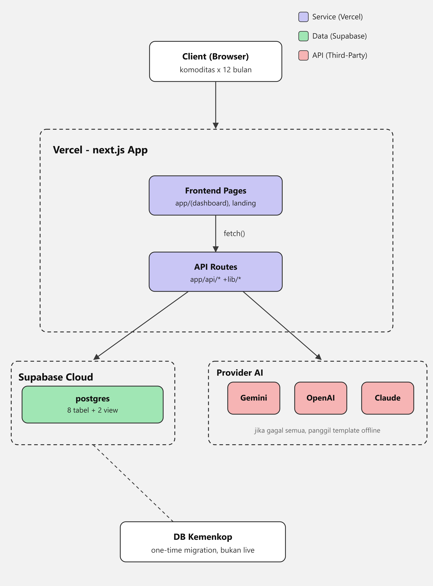

# Komodesa

**Buku besar desa berbasis data** — panen kecil-kecil anggota koperasi dijumlahkan
jadi satu kekuatan tawar. Komodesa memetakan produksi anggota, mengagregasi pasokan
per komoditas, mempertemukannya dengan permintaan buyer, menggabungkan pengiriman
(logistics pooling), dan memberi rekomendasi komoditas berbasis tren.

> Tema 2 — Optimalisasi Potensi Desa melalui Koperasi · Hackathon Digital
> Cooperatives Expo 2026 (Kemenkop).

---

## Arsitektur Sistem



**Alur & keterangan:**

- **Client (Browser)** — pengguna koperasi membuka dashboard; data ditampilkan per
  komoditas lintas 12 bulan.
- **Vercel · Next.js App** — satu aplikasi Next.js 14 (App Router) yang di-deploy di
  Vercel:
  - **Frontend Pages** (`app/(dashboard)`, landing) memanggil backend lewat `fetch()`.
  - **API Routes** (`app/api/*`) berisi logika bisnis, dibantu helper di `lib/*`.
- **Supabase Cloud** — Postgres terkelola berisi **8 tabel + 2 view** (skema di
  `supabase/migrations/`). Sumber data utama aplikasi.
- **Provider AI** — API Routes memanggil provider AI dengan prioritas berjenjang
  **Gemini → OpenAI → Claude**. Jika semua gagal / tanpa API key, sistem memakai
  **narasi template offline** yang deterministik, jadi fitur tetap jalan.
- **DB Kemenkop** — data awal diambil satu kali (*one-time migration*) ke Supabase,
  **bukan koneksi live**.

---

## Teknologi

| Lapisan | Teknologi |
|---|---|
| Framework | Next.js 14.2 (App Router) + React 18 |
| Bahasa | TypeScript 5.5 |
| Styling | Tailwind CSS 3.4 |
| Visualisasi | Recharts 2.12 |
| Database | Supabase (PostgreSQL terkelola) |
| AI (fitur produk) | Google Gemini / OpenAI / Anthropic Claude, dengan fallback template |
| Deploy | Vercel |

---

## Struktur Proyek

```
komodesa/
├── app/
│   ├── (auth)/login/          # Halaman masuk (demo bebas akun)
│   ├── (dashboard)/           # Dashboard, Produksi, Agregasi, Potensi,
│   │                          #   Buyer Matching, Logistik, Rekomendasi AI
│   ├── api/                   # API Routes (aggregate, buyer-match,
│   │                          #   logistics-pool, ai-recommendation, dll.)
│   └── page.tsx               # Landing
├── components/                # UI, dashboard (Nav, StatCard, SupplyChart), forms
├── lib/                       # Logika bisnis & helper
│   ├── supabase.ts            #   Klien Supabase + guard konfigurasi
│   ├── ai.ts                  #   Orkestrasi provider AI + fallback template
│   ├── matching.ts            #   Business matching pasokan → buyer
│   ├── logistics.ts           #   Logistics pooling
│   ├── value-uplift.ts        #   Perhitungan kenaikan nilai
│   └── trend-data.ts          #   Data tren untuk rekomendasi
├── supabase/
│   ├── migrations/            # 8 tabel + 2 view (0001–0005)
│   └── seed/                  # Data seed & pembersihan
└── docs/AI-DISCLOSURE.md      # Pengungkapan penggunaan AI (sesuai TOR)
```

**Skema database** (`supabase/migrations/`): tabel `regions`, `commodities`,
`members`, `production_entries`, `buyer_requests`, `matches`, `logistics_pools`,
`logistics_pool_members`; view `supply_aggregate` dan `unclaimed_supply`.

---

## Panduan Instalasi

### Prasyarat

- **Node.js 18.17+** dan npm
- Akun **Supabase** (untuk database)
- *(Opsional)* API key salah satu provider AI — tanpa ini, fitur rekomendasi tetap
  jalan memakai template offline.

### Langkah

1. **Masuk ke folder proyek**

   ```bash
   cd "hari H/komodesa"
   ```

2. **Install dependensi**

   ```bash
   npm install
   ```

3. **Siapkan environment variables** — salin contoh lalu isi kredensialnya:

   ```bash
   cp .env.local.example .env.local
   ```

   Isi `.env.local`:

   ```env
   # Supabase (wajib)
   NEXT_PUBLIC_SUPABASE_URL=https://<project>.supabase.co
   NEXT_PUBLIC_SUPABASE_ANON_KEY=<anon-key>
   SUPABASE_SERVICE_ROLE_KEY=<service-role-key>

   # AI (opsional — cukup salah satu; urutan prioritas Gemini → OpenAI → Claude)
   GEMINI_API_KEY=
   GEMINI_MODEL=
   OPENAI_API_KEY=
   OPENAI_MODEL=
   ANTHROPIC_API_KEY=
   ANTHROPIC_MODEL=
   ```

4. **Siapkan database Supabase** — jalankan migrasi lalu seed. Buka **SQL Editor** di
   dashboard Supabase dan jalankan berurutan isi file:

   - `supabase/migrations/0001_init.sql` → `0005_region_demographics.sql`
   - `supabase/seed/seed.sql`

   *(Atau gunakan Supabase CLI: `supabase db push` bila proyek sudah di-link.)*

5. **Jalankan mode pengembangan**

   ```bash
   npm run dev
   ```

   Buka **http://localhost:3000**.

### Build produksi

```bash
npm run build
npm run start
```

> Catatan: `npm run build` tetap berhasil walau `.env.local` belum diisi — klien
> Supabase memakai placeholder, dan query runtime akan menampilkan pesan ramah bila
> kredensial belum di-set (lihat `lib/supabase.ts`).

---

## Catatan Autentikasi

Versi demo bisa langsung dijelajahi **tanpa akun** agar penilai dapat menelusuri
seluruh alur nilai koperasi tanpa hambatan. Autentikasi anggota & koperasi via
**Supabase Auth** disiapkan untuk versi produksi.

## Penggunaan AI

Penggunaan AI dalam proyek ini — sebagai alat bantu teknis maupun sebagai fitur
produk — didokumentasikan secara terbuka di [`docs/AI-DISCLOSURE.md`](docs/AI-DISCLOSURE.md),
sesuai ketentuan TOR Hackathon.
